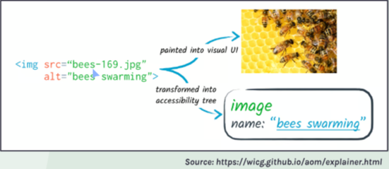
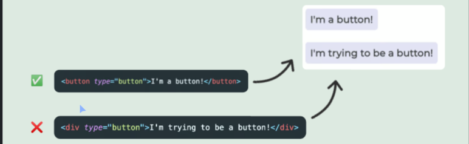

# Web-Accessibility
How to write accessible HTML by solving interactive coding challenges and fixing a real-world website

- What is accessible development?
Accessible content is available, and its functionality can be opreated, by literally anyone.

## 1. Understanding Web Accessibility
- ATs - Assistive Technologies
    - Screen readers
    - Speech recognition software
    - Screen magnifiers
    - Alternative input devices 
 
- The Accessibility Tree 
    
    
 
- DOM(Document Object Model) vs. Accessibility Tree
    1. DOM 
    - **정의** : HTML, XML 문서의 프로그래밍 인터페이스. 웹페이지의 구조를 트리형태로 표현하며, 각 노드는 문서 내의 객체 (예:태그,속성,텍스트 등)를 나타낸다. 이 트리 구조를 통해 프로그래밍 언어(주로 JavaScript)가 문서의 구조, 스타일, 내용을 동적으로 조작할 수 있다.
    - **용도** : 웹 개발자들은 DOM을 사용하여 HTML 문서의 요소를 조회,추가,수정 또는 삭제할 수 있다. 예를 들어, 사용자의 상호작용에 반응하여 웹 페이지에 새로운 내용을 동적으로 추가하거나 변경하는 등의 작업을 할 수 있다.
    - **구조** : DOM은 루트요소(HTML 문서에서는 '<html>'태그)에서 시작하여 요소,속성,텍스트 등을 포함한 트리구조로 구성된다. 각 노드는 특정 유형의 문서객체를 나타내며, 부모-자식 관계를 통해 문서의 계층 구조를 반영한다.
     
    2. Accessibility Tree
    - **정의** : Accessibility Tree 는 웹 페이지의 접근성 정보를 담은 추상화된 트리구조로, 보조기술(예:스크린리더)이 사용자에게 콘텐츠를 전달하는 데 사용하는 정보를 제공한다. 이 트리는 DOM에서 파생되지만, 시각정표현이나 레이아웃 정보 대신 접근성 관련 정보(예:역할,이름,상태 등)에 중점을 둔다.
    - **용도** : Accessibility Tree 는 스크린 리더와 같은 보조기술이 웹 페이지의 내용을 해석하고 사용자에게 전달하는 데 사용된다. 예를 들어, 버튼의 역할이나 입력 필드의 레이블과 같은 중요한 접근성 정보를 제공하여, 시각장애인 사용자가 웹 페이지를 탐색하고 상호작용할 수 있도록 돕는다.
    - **구조** : Accessibility Tree 는 DOM트리와 유사한 구조를 가지지만, 모든 DOM요소가 Accessibility Tree에 포함되는 것은 아니다. 예를 들어, 시각적으로 표시되지 않는 요소가 접근성에 기여하지 않는 요소(예:순수한 레이아웃을 위한 '
'나'')는 생략될 수 있다. 대신, 요소의 역할(role), 이름(name), 상태(state)등 접근성을 위한 중요한 정보가 포함된다.
     
    3. DOM 과 Accessibility Tree 의 관계
    - DOM은 웹페이지의 전체 구조와 내용을 나타내는 반면, Accessibility Tree 는 DOM의 접근성 관련 부분만을 추출하여 보조 기술이 사용하기 쉬운 형태로 제공한다.
    - 웹 개발 시, HTML 요소에 'role','aria-*' 속성 등을 적절히 사용하면 Accessibility Tree 에서 요소의 접근성 정보가 향상된다. 이는 보조기술 사용자가 웹 페이지를 더 잘 이해하고 사용할 수 있게 도와준다.
    - Accessibility Tree 는 사용자에게 직접적으로 보이지 않지만, 웹 접근성을 개선하는 데 중요한 역할을 한다. 따라서 웹 개발 과정에서 접근성을 고려한 마크업을 ARIA(Accessible Rich Internet Applications) 사용은 매우 중요하다.
 
- Accessibility testing
    - Using AT
    - Contrast Checkers
    - Automated Tools 
        - Lighthouse (chrome devTools)
        - Accessibility Inspector
        - aXe
    - AI assistants